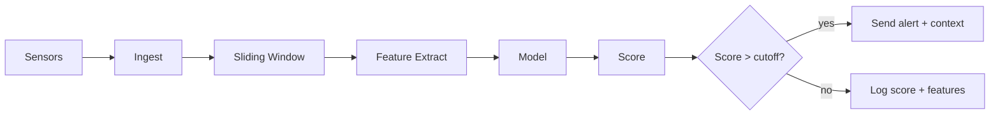

## What it shows
How raw sensor data turns into an alert or a log. One path in. One decision point. Two outputs.

## The picture

## Steps in order
1. **Sensors → Ingest**  
   Read tag values. Example: Modbus/TCP or OPC-UA.

2. **Ingest → Buffer (sliding window)**  
   Keep the last N points per tag. Oldest drops first.

3. **Buffer → Feature Extract**  
   Compute simple stats per window. Mean. Std. Min. Max. Delta. Rate of change.

4. **Features → Model**  
   Run a lightweight model. Example: z-score. IsolationForest. One-Class SVM. Small tree. Linear.

5. **Model → Score**  
   Produce one number per tick. Higher means more abnormal.

6. **Score → Threshold**  
   Compare score to a cutoff.

7. **Decision**  
   - **Yes** (score > cutoff) → **Alert**  
     Send message with tag name. Score. Window stats. Last values.  
   - **No** → **Log**  
     Store score and features for learning and dashboards.

## Inputs and outputs
- **Input**: time series from sensors.
- **Output A**: alert to people or tools.
- **Output B**: log row with features and score.

## Knobs you can tune
- Window length N.
- Feature set.
- Model type and parameters.
- Cutoff value.

## What to store
- Timestamp. Tag id. Score. Cutoff.
- Features used.
- Alert payload if fired.
- Optional raw window slice.

## Metrics to watch
- Precision and recall or PR-AUC.
- Alert latency.
- False positive rate.
- Drift in feature distributions.

## Edge constraints
- Run fast. Low CPU and RAM. No GPU.
- Fail closed on data gaps. If window too small then skip alert and log reason.

## Failure cases and actions
- **Missing data**: hold state and log a gap event.
- **Flatline**: detect zero variance and alert as sensor fault.
- **Clock skew**: reject out-of-order points and log.

