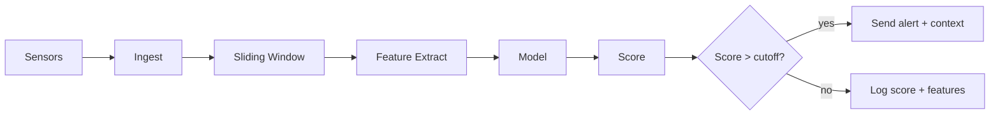

## 1) System Context Diagram
**Purpose:** Show who/what connects to your detector.

**Contents:**
- External: Sensors/PLCs, Historian/SCADA, Operators, CMMS.
- Internal: Edge device, Model service, Alerting, Storage.
- Flows: data in, alerts out, feedback in.

**Steps:**
1. Open diagrams.net. New blank diagram.
2. Drop blocks and label:
   - Sensors → Ingest → Edge Box (Model) → Alert Sink.
   - Side arrows: SCADA/Historian ↔ Ingest, CMMS ↔ Storage.
3. Add protocols near arrows: Modbus/TCP, MQTT, CSV, HTTP.
4. Save as `docs/diagrams/system-context.drawio` and export PNG.

**Checklist:**
- One ingress, one egress, one feedback loop.
- Note compute limits on edge box (CPU/RAM line).

---

## 2) Data Flow Diagram (DFD)
**Purpose:** Show processing steps from raw stream to alert.

**Nodes:**
- Ingest → Buffer (sliding window) → Feature Extract → Model → Score → Threshold → {Alert | Log}.

**Mermaid (paste into README or docs):**


**Steps:**
1. Use Mermaid for speed or diagrams.net for a polished version.
2. Annotate each edge with data shape:
   - Ingest: `(timestamp, tag, value)`
   - Buffer: `(window_len, step, n_signals)`
   - Features: `(k_features)`
   - Score: `float`
3. Save as `docs/diagrams/data-flow.drawio` or keep Mermaid in `docs/diagrams/data-flow.md`.

**Checklist:**
- Each step has clear input and output.
- Add “Feedback: operator label → Retrain” loop to Model if space allows.

---

## 3) Sliding-Window Timeline
**Purpose:** Make window length, stride, and detection latency explicit.

**What to show:**
- Raw time axis with ticks.
- Rectangles for windows.
- Parameters: `window_len`, `stride`, `overlap = 1 - stride/window_len`.
- Mark when a fault starts and when the first alert could fire.

**Fast approach:**
- Draw in diagrams.net with horizontal bars.
- Or add an ASCII block in Markdown:

```
time ──▶  t0   t1   t2   t3   t4   t5   t6
window_len = 60s, stride = 10s
[ t0 ─────────── t60 )
      [ t10 ─────────── t70 )
            [ t20 ─────────── t80 )
first possible alert = window end + model_infer_ms
```

**Annotate:**
- Compute latency ≈ `window_len + compute_time`.
- Show overlap percentage.
- Note memory need: `window_len * sampling_rate * n_signals`.

**Save:** `docs/diagrams/sliding-window.png`.

---

## 6) Threshold Tuning Chart
**Purpose:** Pick a cutoff that caps false alarms and keeps recall acceptable.

**Inputs (small CSV for mockup):**
- `timestamp, label, score`
  - `label` ∈ {0,1} for no-fault/fault.
  - `score` high = more anomalous.

**Metrics to plot vs threshold τ:**
- Alerts/day at τ.
- Precision at τ.

**Procedure:**
1. Sort unique scores as candidate thresholds.
2. For each τ:
   - `alerts = sum(score ≥ τ)`
   - `tp = sum(score ≥ τ and label=1)`
   - `fp = alerts - tp`
   - `precision = tp / max(alerts, 1)`
   - `alerts_per_day = alerts / n_days`
3. Plot:
   - X-axis: τ.
   - Left Y: alerts/day.
   - Right Y: precision.
   - Draw a vertical line at chosen τ.

**Operating point rule:**
- Set τ where `alerts/day ≤ target` (e.g., 1/day) with the highest precision.
- Record τ in config.

**File outputs:**
- Code notebook: `notebooks/threshold_tuning.ipynb`.
- Plot: `docs/plots/threshold-vs-alerts-precision.png`.
- Config update: `configs/detector.yaml`
  ```yaml
  threshold:
    score_cutoff: 2.35
    target_alerts_per_day: 1
    last_fitted: 2025-10-23
  ```

**Checklist:**
- Use holdout data only.
- Recompute after retraining or drift.

---

## Naming and Storage
- Diagrams: `docs/diagrams/*`
- Tables/notes: `docs/tables/*`
- Plots: `docs/plots/*`
- Keep a short “Assumptions.md” alongside each artifact with parameter values used.

## Minimal Order of Work
1. System Context.
2. DFD.
3. Sliding-Window.
4. Threshold Tuning chart on sample data.
