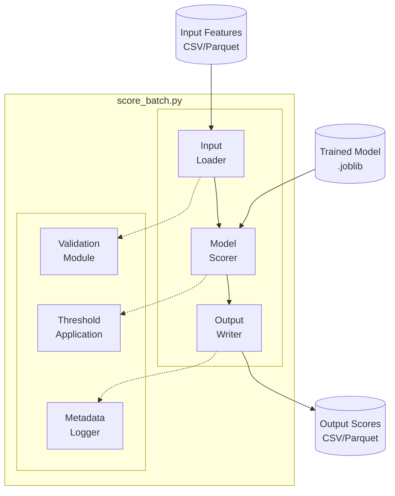

# System Design Document: score_batch.py


## 1. Executive Summary

`score_batch.py` is the **Stage 6** production inference script that applies trained anomaly detection models to new sensor data. It serves as the operational deployment component of the predictive maintenance pipeline, enabling batch scoring of equipment sensor readings to identify anomalies and generate maintenance alerts.

**Key Purpose:** Transform trained ML models into actionable predictions for production environments.

---

## 2. System Context



### 2.1 Position in Pipeline

```
Stage 1: prep_data.py      → Clean raw sensor data
Stage 2: make_features.py  → Extract time-domain features
Stage 3: train.py          → Train anomaly detection models
Stage 4: threshold.py      → Calibrate alert thresholds
Stage 5: evaluate.py       → Generate performance reports
Stage 6: score_batch.py    ← THIS SCRIPT (Production Inference)
```

### 2.2 Use Cases

1. **Production Deployment**: Score live sensor data from factory equipment
2. **Batch Processing**: Analyze historical data for anomaly patterns
3. **Model Validation**: Test model performance on holdout/new datasets
4. **A/B Testing**: Compare predictions from different models on same data
5. **Alert Generation**: Identify equipment requiring maintenance

---

## 3. Functional Requirements

### 3.1 Core Capabilities

| Requirement | Description | Priority |
|-------------|-------------|----------|
| **FR-1** | Load trained model artifacts (.joblib) | Critical |
| **FR-2** | Load input features (CSV/Parquet) | Critical |
| **FR-3** | Generate anomaly scores for all samples | Critical |
| **FR-4** | Apply calibrated threshold for binary alerts | Critical |
| **FR-5** | Save predictions with metadata | Critical |
| **FR-6** | Support all 4 model types (IForest, LOF, SVM, Autoencoder) | High |
| **FR-7** | Preserve input timestamps and identifiers | High |
| **FR-8** | Handle missing/invalid features gracefully | Medium |
| **FR-9** | Log processing statistics | Medium |
| **FR-10** | Support streaming/chunked processing for large files | Low |

### 3.2 Out of Scope (for v1.0)

- Real-time streaming inference (use batch mode only)
- Model retraining or online learning
- Multi-model ensemble predictions
- Database integration (file I/O only)
- API server deployment

---

## 4. System Architecture

### 4.1 High-Level Design
# Score Batch Architecture


### 4.2 Component Breakdown

#### Component 1: Input Loader
**Purpose:** Load and validate input feature data

**Responsibilities:**
- Read CSV/Parquet files
- Validate feature schema matches training
- Handle missing columns/features
- Preserve metadata columns (timestamp, unit_id, etc.)

**Inputs:** File path, expected feature list
**Outputs:** DataFrame with features + metadata

---

#### Component 2: Model Scorer
**Purpose:** Load model and generate anomaly scores

**Responsibilities:**
- Load trained model from .joblib artifact
- Extract scaler and feature list from model metadata
- Apply same preprocessing as training
- Generate anomaly scores using model's `score_samples()` or `decision_function()`

**Inputs:** Model file, feature DataFrame
**Outputs:** Anomaly scores (continuous values)

---

#### Component 3: Threshold Application
**Purpose:** Convert scores to binary alerts

**Responsibilities:**
- Load calibrated threshold from model metadata or separate file
- Apply threshold: `is_anomaly = (score > threshold)`
- Handle edge cases (scores == threshold)

**Inputs:** Anomaly scores, threshold value
**Outputs:** Binary alert flags (0=normal, 1=anomaly)

---

#### Component 4: Output Writer
**Purpose:** Save predictions with metadata

**Responsibilities:**
- Combine original metadata + scores + alerts
- Save to CSV and Parquet formats
- Include column headers and data types
- Log output statistics (total samples, anomaly count, etc.)

**Inputs:** Scores, alerts, metadata
**Outputs:** CSV/Parquet files with predictions

---

#### Component 5: Validation Module
**Purpose:** Ensure data integrity

**Responsibilities:**
- Check feature count matches model expectations
- Validate feature names match training
- Detect missing values
- Handle feature engineering mismatches

**Inputs:** Input data, model metadata
**Outputs:** Validation report (errors/warnings)

---

#### Component 6: Metadata Logger
**Purpose:** Record run information for reproducibility

**Responsibilities:**
- Log model file path and version
- Log input file path and row count
- Log timestamp of scoring run
- Log anomaly detection statistics
- Save to JSON file alongside outputs

**Inputs:** Run parameters and results
**Outputs:** JSON metadata file

---

## 5. Data Flow

### 5.1 Processing Sequence

```
1. CLI Arguments Parsing
   ├── --model: Path to trained model (.joblib)
   ├── --input: Path to input features (CSV/Parquet)
   ├── --output: Path to save predictions (CSV/Parquet)
   └── --threshold: (Optional) Override calibrated threshold

2. Model Loading
   ├── Load .joblib artifact
   ├── Extract model object
   ├── Extract scaler object
   ├── Extract feature list
   ├── Extract calibrated threshold (if available)
   └── Validate model integrity

3. Input Data Loading
   ├── Read CSV/Parquet file
   ├── Identify feature columns
   ├── Identify metadata columns (timestamp, unit_id, etc.)
   ├── Validate feature schema
   └── Handle missing values (warn or impute)

4. Feature Alignment
   ├── Reorder columns to match training order
   ├── Drop extra columns not used in training
   ├── Check for missing features (error if critical)
   └── Store metadata separately

5. Preprocessing
   ├── Apply same scaler used in training
   ├── Transform features to scaled values
   └── Validate no NaN/Inf after scaling

6. Scoring
   ├── Call model.score_samples(X) or model.decision_function(X)
   ├── Generate continuous anomaly scores
   └── Store scores alongside data

7. Threshold Application
   ├── Load calibrated threshold from model or CLI arg
   ├── Apply: is_anomaly = (score > threshold)
   └── Count anomaly rate

8. Output Generation
   ├── Combine: metadata + features + scores + alerts
   ├── Add columns: [anomaly_score, is_anomaly, threshold_used]
   ├── Save to output_path.csv
   ├── Save to output_path.parquet
   └── Save metadata to output_path_metadata.json

9. Logging & Statistics
   ├── Log total samples processed
   ├── Log anomaly count and percentage
   ├── Log processing time
   └── Print summary to console
```

### 5.2 Data Schemas

#### Input Schema (Features)
```
Required columns:
- All features used during model training (e.g., ch1_mean, ch1_std, ch1_rms, ...)

Optional metadata columns (preserved in output):
- timestamp (datetime)
- unit_id (int/str)
- file_name (str)
- window_id (int)
- cycle (int) for C-MAPSS
- fault_type (str) for CWRU
```

#### Output Schema (Predictions)
```
All input columns +
- anomaly_score (float): Continuous score from model
- is_anomaly (bool/int): Binary alert (1=anomaly, 0=normal)
- threshold_used (float): Threshold applied for this run
- scored_at (datetime): Timestamp of scoring run
- model_name (str): Name of model used
```

#### Metadata Schema (JSON)
```json
{
  "run_info": {
    "timestamp": "2025-11-27T10:30:00Z",
    "script_version": "1.0",
    "git_commit": "a1b2c3d"
  },
  "model_info": {
    "model_path": "artifacts/models/ims_iforest.joblib",
    "model_type": "isolation_forest",
    "trained_on": "2025-11-26",
    "features_used": ["ch1_mean", "ch1_std", ...]
  },
  "input_info": {
    "input_path": "data/features/ims_test.csv",
    "total_samples": 5000,
    "date_range": "2003-11-01 to 2003-11-30"
  },
  "scoring_results": {
    "threshold_used": 0.4851,
    "anomalies_detected": 47,
    "anomaly_rate": 0.0094,
    "processing_time_seconds": 1.23
  }
}
```

---

## 6. Interface Specifications

### 6.1 Command-Line Interface

```bash
python scripts/score_batch.py \
  --model <MODEL_PATH> \
  --input <INPUT_PATH> \
  --output <OUTPUT_PATH> \
  [--threshold <FLOAT>] \
  [--batch-size <INT>] \
  [--verbose]
```

#### Arguments

| Argument | Type | Required | Description | Example |
|----------|------|----------|-------------|---------|
| `--model` | str | Yes | Path to trained model (.joblib) | `artifacts/models/ims_iforest.joblib` |
| `--input` | str | Yes | Path to input features (CSV/Parquet) | `data/features/ims_test.csv` |
| `--output` | str | Yes | Path to save predictions (without extension) | `artifacts/scores/ims_test_scores` |
| `--threshold` | float | No | Override calibrated threshold | `0.5` |
| `--batch-size` | int | No | Process data in chunks (for large files) | `10000` |
| `--verbose` | flag | No | Enable detailed logging | N/A |

### 6.2 Example Usage

#### Example 1: Score IMS test data with Isolation Forest
```bash
python scripts/score_batch.py \
  --model artifacts/models/ims_iforest.joblib \
  --input data/features/ims_test.csv \
  --output artifacts/scores/ims_iforest_test_scores
```

#### Example 2: Score CWRU data with custom threshold
```bash
python scripts/score_batch.py \
  --model artifacts/models/cwru_iforest.joblib \
  --input data/features/cwru_test.csv \
  --output artifacts/scores/cwru_test_scores \
  --threshold 0.55
```

#### Example 3: Score C-MAPSS data with verbose logging
```bash
python scripts/score_batch.py \
  --model artifacts/models/fd001_iforest.joblib \
  --input data/features/fd001_test.csv \
  --output artifacts/scores/fd001_test_scores \
  --verbose
```

---

## 7. Error Handling

### 7.1 Error Categories

| Error Type | Severity | Handling Strategy |
|------------|----------|-------------------|
| Model file not found | Critical | Exit with error message |
| Input file not found | Critical | Exit with error message |
| Feature mismatch (missing critical features) | Critical | Exit with error message |
| Feature mismatch (extra features) | Warning | Drop extra columns, continue |
| Missing threshold in model | Warning | Use default contamination threshold |
| NaN/Inf in input data | Warning | Skip rows or impute with mean |
| Output directory not writable | Critical | Exit with error message |
| Memory overflow (large file) | Warning | Suggest using --batch-size |

### 7.2 Error Messages

**Example 1: Missing Features**
```
ERROR: Input data missing required features: ['ch3_rms', 'ch4_kurtosis']
Expected features: ['ch1_mean', 'ch1_std', 'ch1_rms', 'ch2_mean', 'ch2_std', 'ch2_rms', 'ch3_mean', 'ch3_std', 'ch3_rms', 'ch4_mean', 'ch4_std', 'ch4_kurtosis']
Found features: ['ch1_mean', 'ch1_std', 'ch1_rms', 'ch2_mean', 'ch2_std', 'ch2_rms', 'ch3_mean', 'ch3_std', 'ch4_mean', 'ch4_std']

Solution: Ensure input data has been processed with make_features.py using the same configuration as training.
```

**Example 2: Model Loading Failure**
```
ERROR: Failed to load model from artifacts/models/ims_iforest.joblib
Reason: File not found

Solution: Check that the model path is correct and the model file exists. List available models with:
  ls artifacts/models/
```

---

## 8. Non-Functional Requirements

### 8.1 Performance

| Metric | Target | Measurement |
|--------|--------|-------------|
| **Throughput** | 10,000 samples/second on laptop CPU | Time per sample |
| **Latency** | < 5 seconds for 10,000 samples | Total processing time |
| **Memory** | < 2 GB RAM for 100,000 samples | Peak memory usage |
| **File I/O** | < 10 seconds to load 100,000 rows | Data loading time |

### 8.2 Scalability

| Scenario | Input Size | Expected Behavior |
|----------|------------|-------------------|
| **Small batch** | 1,000 samples | In-memory processing, instant results |
| **Medium batch** | 100,000 samples | In-memory processing, < 1 minute |
| **Large batch** | 1,000,000 samples | Chunked processing with --batch-size, < 10 minutes |
| **Very large batch** | 10,000,000 samples | Recommend splitting file or streaming mode |

### 8.3 Reliability

- **Idempotency**: Running the script twice with the same inputs produces identical outputs
- **Atomicity**: If script fails mid-run, partial output files are deleted
- **Logging**: All runs logged with timestamps, inputs, outputs, and results

### 8.4 Maintainability

- **Code style**: Follow PEP 8, type hints for all functions
- **Documentation**: Docstrings for all public functions
- **Testing**: Unit tests for core functions (model loading, scoring, threshold application)
- **Modularity**: Separate functions for loading, scoring, and saving (enable reuse)

---

## 9. Design Decisions

### 9.1 Why Batch Processing (Not Streaming)?

**Decision:** Implement batch mode only (Stage 6 v1.0)

**Rationale:**
- Simpler implementation (no state management)
- Aligns with existing pipeline stages (all batch-based)
- Sufficient for most predictive maintenance use cases (daily/hourly scoring)
- Can be extended to streaming later if needed

**Trade-offs:**
- Cannot handle real-time alerting (< 1 second latency)
- Must wait for full batch before processing

---

### 9.2 Why Dual Output Formats (CSV + Parquet)?

**Decision:** Save both CSV and Parquet outputs

**Rationale:**
- **Parquet**: 10x smaller, faster I/O, preserves types (production use)
- **CSV**: Human-readable, Excel-compatible, universal (inspection/debugging)
- Consistent with pipeline architecture (all stages use dual outputs)

**Trade-offs:**
- 2x disk space usage
- Slightly slower write times

---

### 9.3 Why Embed Threshold in Model vs. Separate File?

**Decision:** Store threshold in model metadata (inside .joblib)

**Rationale:**
- Single artifact for deployment (model + threshold together)
- Prevents threshold/model version mismatch
- Allows CLI override for flexibility (--threshold flag)

**Implementation:**
```python
# In train.py (Stage 3) or threshold.py (Stage 4):
model_artifact = {
    'model': trained_model,
    'scaler': scaler,
    'features': feature_list,
    'threshold': calibrated_threshold,  # Added here
    'metadata': {...}
}
joblib.dump(model_artifact, 'artifacts/models/ims_iforest.joblib')
```

---

### 9.4 Why Not Config-Driven Like Other Stages?

**Decision:** Use CLI arguments instead of YAML config

**Rationale:**
- Scoring is operational (not experimental), needs flexibility
- Different users may score different inputs with same model
- CLI args are simpler for automation/scripting
- Config files are better for complex multi-stage workflows

**Trade-offs:**
- Less consistency with other pipeline stages
- Must specify paths manually (not stored in config)

---

### 9.5 Feature Alignment Strategy

**Decision:** Auto-align features by name, error if critical features missing

**Rationale:**
- Robust to column order changes
- Prevents silent failures from feature mismatches
- Allows extra metadata columns (timestamp, unit_id) without errors

**Implementation:**
```python
# Extract expected features from model
expected_features = model_artifact['features']

# Check for missing features
missing_features = set(expected_features) - set(input_df.columns)
if missing_features:
    raise ValueError(f"Missing features: {missing_features}")

# Reorder input to match training order
X = input_df[expected_features]
```

---

## 10. Testing Strategy

### 10.1 Unit Tests

| Test Case | Description | Expected Result |
|-----------|-------------|-----------------|
| `test_load_model` | Load valid .joblib file | Model object returned |
| `test_load_model_invalid_path` | Load non-existent file | FileNotFoundError raised |
| `test_score_samples` | Score 100 samples | 100 scores returned |
| `test_threshold_application` | Apply threshold=0.5 to scores | Binary alerts generated |
| `test_feature_alignment` | Reorder columns to match training | No errors, correct order |
| `test_missing_features` | Input missing 2 critical features | ValueError raised |
| `test_extra_columns` | Input has metadata columns | Metadata preserved in output |

### 10.2 Integration Tests

| Test Case | Description | Expected Result |
|-----------|-------------|-----------------|
| `test_score_ims_iforest` | Score IMS test set with Isolation Forest | Output CSV/Parquet with predictions |
| `test_score_cwru_lof` | Score CWRU test set with LOF | Predictions match expected format |
| `test_custom_threshold` | Override threshold via --threshold flag | Custom threshold applied, not model default |
| `test_large_batch` | Score 100,000 samples | Completes in < 2 minutes |

### 10.3 Validation Tests

| Test Case | Description | Expected Result |
|-----------|-------------|-----------------|
| `test_idempotency` | Run script twice with same inputs | Identical outputs (deterministic) |
| `test_no_leakage` | Score test set, check no training data overlap | Zero samples overlap |
| `test_metadata_preserved` | Check timestamps in output match input | All timestamps preserved |

---

## 11. Deployment Considerations

### 11.1 Production Checklist

- [ ] Model artifact (.joblib) includes threshold metadata
- [ ] Input data matches training feature schema
- [ ] Output directory has write permissions
- [ ] Sufficient disk space for outputs (estimate 2x input size)
- [ ] Python environment has all dependencies (scikit-learn, pandas, joblib)
- [ ] Logging configured for production (file-based, not console)

### 11.2 Automation Example

**Daily Scoring Cron Job (Linux/Mac):**
```bash
#!/bin/bash
# daily_scoring.sh

DATE=$(date +%Y%m%d)
MODEL="artifacts/models/ims_iforest.joblib"
INPUT="data/daily_batches/ims_${DATE}.csv"
OUTPUT="artifacts/scores/ims_scores_${DATE}"

python scripts/score_batch.py \
  --model $MODEL \
  --input $INPUT \
  --output $OUTPUT \
  --verbose >> logs/scoring_${DATE}.log 2>&1

# Alert if anomalies detected
ANOMALY_COUNT=$(grep "anomalies_detected" ${OUTPUT}_metadata.json | grep -oP '\d+')
if [ "$ANOMALY_COUNT" -gt 0 ]; then
  echo "WARNING: $ANOMALY_COUNT anomalies detected on $DATE" | mail -s "Anomaly Alert" admin@factory.com
fi
```

**Crontab Entry (run daily at 2 AM):**
```
0 2 * * * /path/to/daily_scoring.sh
```

---

## 12. Future Enhancements (Post v1.0)

### 12.1 Potential Features

| Enhancement | Priority | Effort | Value |
|-------------|----------|--------|-------|
| **Streaming mode** (process files line-by-line) | Medium | High | High |
| **Multi-model ensemble** (combine predictions) | Low | Medium | Medium |
| **API server** (REST endpoint for scoring) | High | High | High |
| **Database integration** (load from/save to SQL) | Medium | Medium | Medium |
| **SHAP explanations per sample** | Low | Low | High |
| **Alert prioritization** (rank anomalies by severity) | Medium | Low | High |
| **Model versioning** (track model lineage) | Low | Medium | Medium |

### 12.2 API Server Design (Future)

**Flask/FastAPI Endpoint:**
```python
@app.post("/score")
def score_endpoint(data: SensorData):
    """Score sensor data and return anomaly predictions."""
    scores = model.score_samples(data.features)
    alerts = scores > threshold
    return {
        "anomaly_scores": scores.tolist(),
        "is_anomaly": alerts.tolist()
    }
```

---

## 13. Acceptance Criteria

### 13.1 Definition of Done

The script is considered complete when:

- [ ] **FR-1 to FR-7 implemented** (all critical/high priority requirements)
- [ ] **CLI works with all 4 model types** (IForest, LOF, SVM, Autoencoder)
- [ ] **Outputs match schema** (CSV + Parquet + JSON metadata)
- [ ] **Unit tests pass** (>80% code coverage)
- [ ] **Integration test passes** (score IMS test set successfully)
- [ ] **Documentation complete** (usage examples in CLAUDE.md)
- [ ] **Manual testing** (score all 10 trained models on test sets)
- [ ] **Code review approved** (PEP 8 compliant, docstrings present)

### 13.2 Success Metrics

| Metric | Target | Actual | Status |
|--------|--------|--------|--------|
| Throughput | >10,000 samples/sec | TBD | ⏳ Pending |
| Latency | <5 sec for 10K samples | TBD | ⏳ Pending |
| Memory | <2 GB for 100K samples | TBD | ⏳ Pending |
| Accuracy | Predictions match evaluate.py | TBD | ⏳ Pending |

---

## 14. References

### 14.1 Related Documents

- `/mnt/c/Users/Jason/predictive-maintenance/CLAUDE.md` - Project architecture
- `/mnt/c/Users/Jason/predictive-maintenance/configs/models/*.yaml` - Model configurations
- Threshold calibration results (Stage 4 summary in CLAUDE.md)

### 14.2 Code References

- `scripts/train.py` - Model training (shows how models are saved)
- `scripts/threshold.py` - Threshold calibration (shows threshold metadata)
- `scripts/evaluate.py` - Evaluation (similar scoring logic)

### 14.3 External Resources

- scikit-learn `score_samples()` documentation
- pandas I/O documentation (CSV/Parquet)
- joblib serialization documentation

---

## Appendix A: Model-Specific Scoring Methods

Different models use different scoring functions:

| Model Type | Scoring Method | Output Range | Anomaly Condition |
|------------|----------------|--------------|-------------------|
| **Isolation Forest** | `score_samples(X)` | [-∞, 0] | score < threshold (more negative = anomaly) |
| **LOF** | `score_samples(X)` | [-∞, 0] | score < threshold (more negative = anomaly) |
| **One-Class SVM** | `decision_function(X)` | [-∞, +∞] | score < 0 (negative = anomaly) |
| **Autoencoder** | Custom: `reconstruction_error(X)` | [0, +∞] | error > threshold (higher = anomaly) |

**Implementation Note:** Normalize all scores to a consistent convention:
- **Higher score = more anomalous** (flip signs if needed)
- Threshold always applied as `score > threshold`

---

## Appendix B: Example Output

**Input:** `ims_test.csv` (5,000 samples)

**Output CSV:** `ims_test_scores.csv`
```csv
timestamp,window_id,ch1_mean,ch1_std,ch1_rms,...,anomaly_score,is_anomaly,threshold_used,model_name
2003-11-01 00:00:00,0,0.012,0.045,0.047,...,0.382,0,0.4851,ims_iforest
2003-11-01 00:01:00,1,0.013,0.046,0.048,...,0.391,0,0.4851,ims_iforest
2003-11-01 00:02:00,2,0.014,0.047,0.049,...,0.523,1,0.4851,ims_iforest
...
```

**Output Metadata:** `ims_test_scores_metadata.json`
```json
{
  "run_info": {
    "timestamp": "2025-11-27T10:30:00Z",
    "script_version": "1.0",
    "git_commit": "7c127d7"
  },
  "model_info": {
    "model_path": "artifacts/models/ims_iforest.joblib",
    "model_type": "isolation_forest",
    "features_used": ["ch1_mean", "ch1_std", "ch1_rms", "ch2_mean", ...]
  },
  "input_info": {
    "input_path": "data/features/ims_test.csv",
    "total_samples": 5000,
    "date_range": "2003-11-01 to 2003-11-30"
  },
  "scoring_results": {
    "threshold_used": 0.4851,
    "anomalies_detected": 47,
    "anomaly_rate": 0.0094,
    "processing_time_seconds": 1.23
  }
}
```

---

## Document Approval

| Role | Name | Signature | Date |
|------|------|-----------|------|
| **Author** | System Design | __________ | 2025-11-27 |
| **Reviewer** | TBD | __________ | TBD |
| **Approver** | TBD | __________ | TBD |

---

**End of Document**
